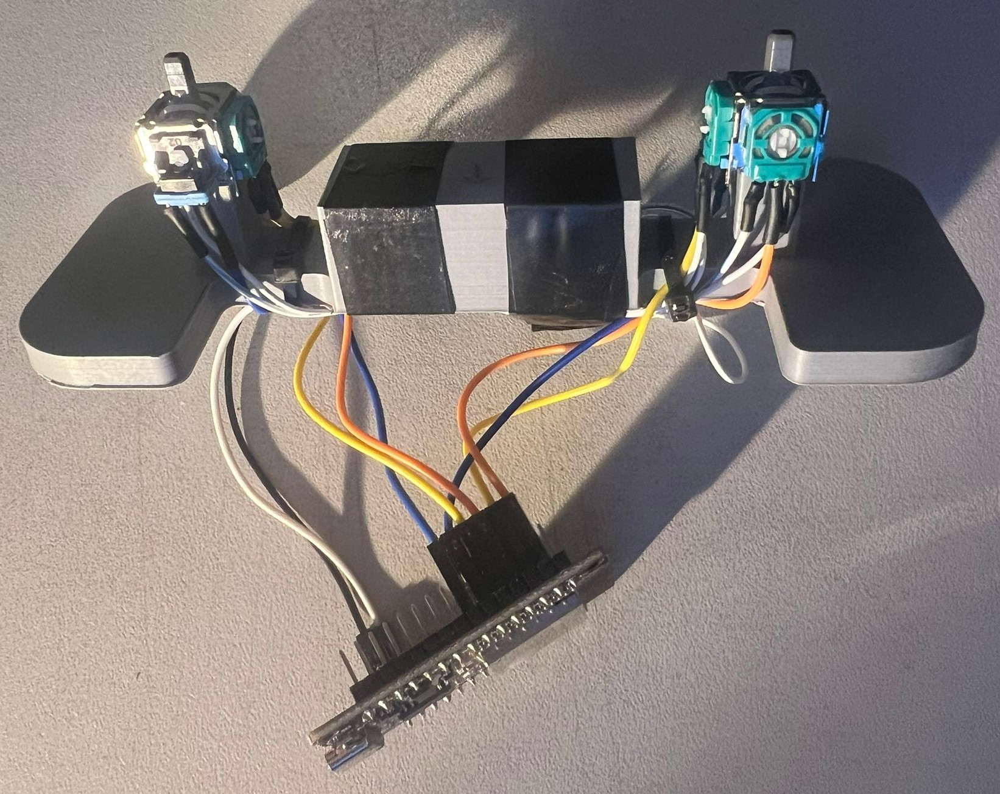
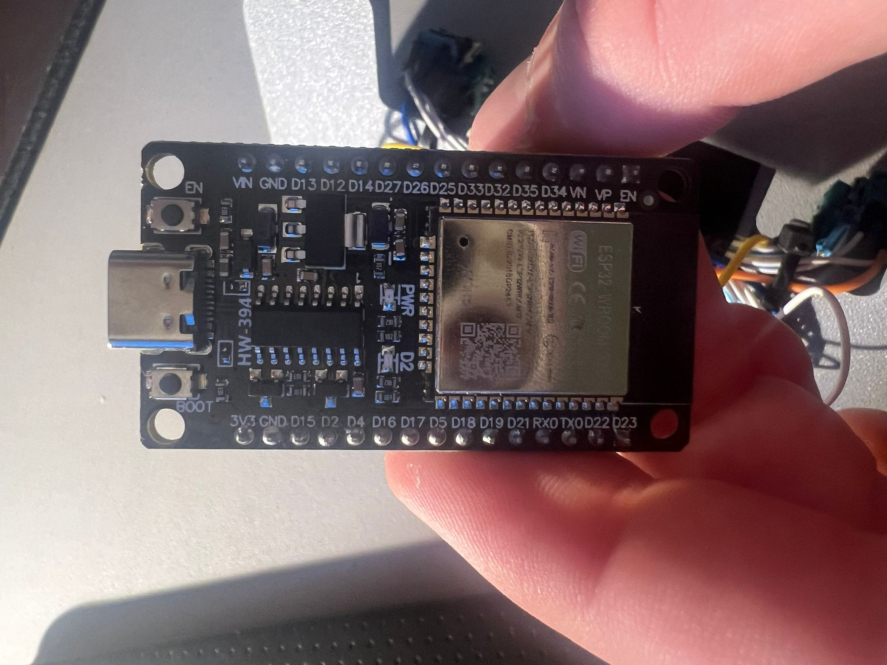
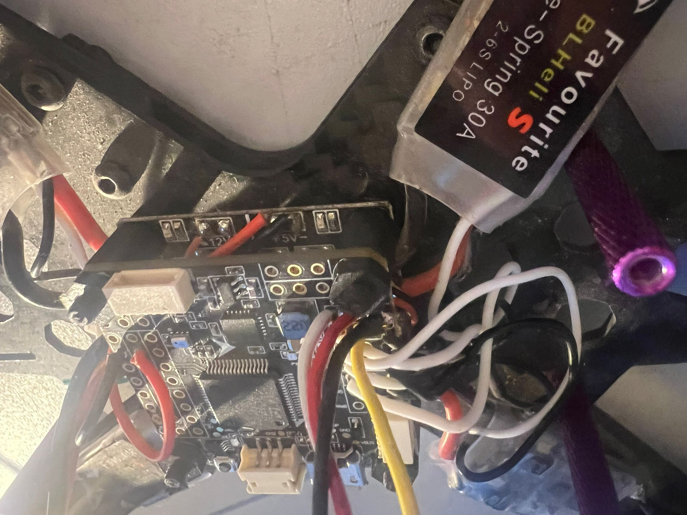
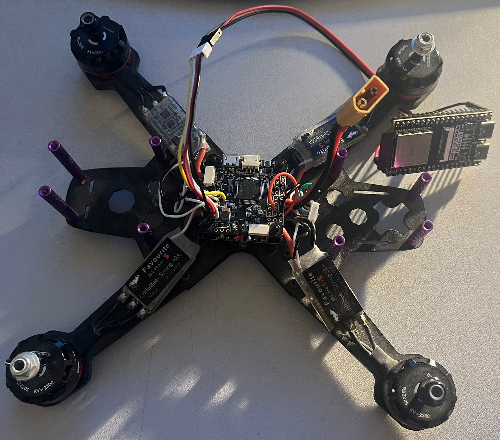

# ESPNowQuadReciver

## Introduction
The goal is to use 2 esp32 boards wheres one of them will send the joystick commands and the second one will transfer the commands to a bought flight controller.

### Sender 
To control the quad ive printed a 3d controller with 2 thumb joysticks that also has push buttons for ARMing and changing the flight mode.
They are connected to an esp32.

  
   

### Recivcer 
The Recivcer is an esp32s3 which sends via IBUS the recived commands to the flight controller running betaFlight.
One of the signals is a constant number that is checked upon recive to validate the message.

  
   

### Demonstration video
A small video of the system working in the betaFlight app.
<video src="https://github.com/mmax1406/ESPNowQuadReciver/assets/83958573/7fff8d3d-69e9-45aa-8dc3-a3fcc9aecb53" style="width: auto; height: auto;"></video>

